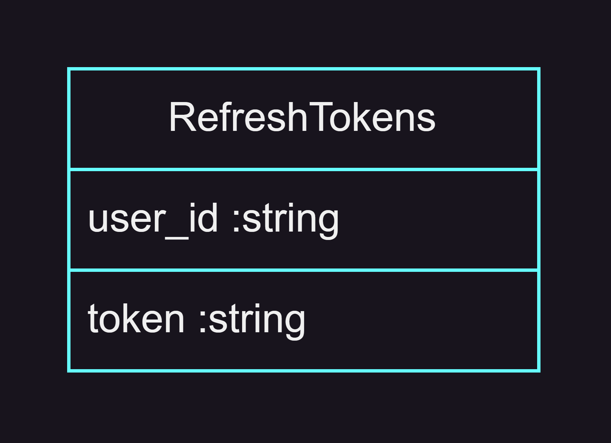

# RedNet-api-gateway

## Features
* User authentication/authorization
* Request redirection

## API
* HTTP POST /api/auth/signup - user registration
  - username :string
  - password :string
  - email :string
* HTTP POST /api/auth/signin - log in application
  - username :string
  - password :string
* HTTP POST /api/auth/signout - log out from application
* HTTP POST /api/auth/refresh-token - get new token pair if access token is expired
* HTTP GET /api/auth/verify-email?token=<> - verify email to activate account during registration
* HTTP POST /api/auth/resend-email-verification - resend email verification letter to activate account during registration

## Database Diagram

## Technology Stack
* Business-logic server\
  
* Database\
  
